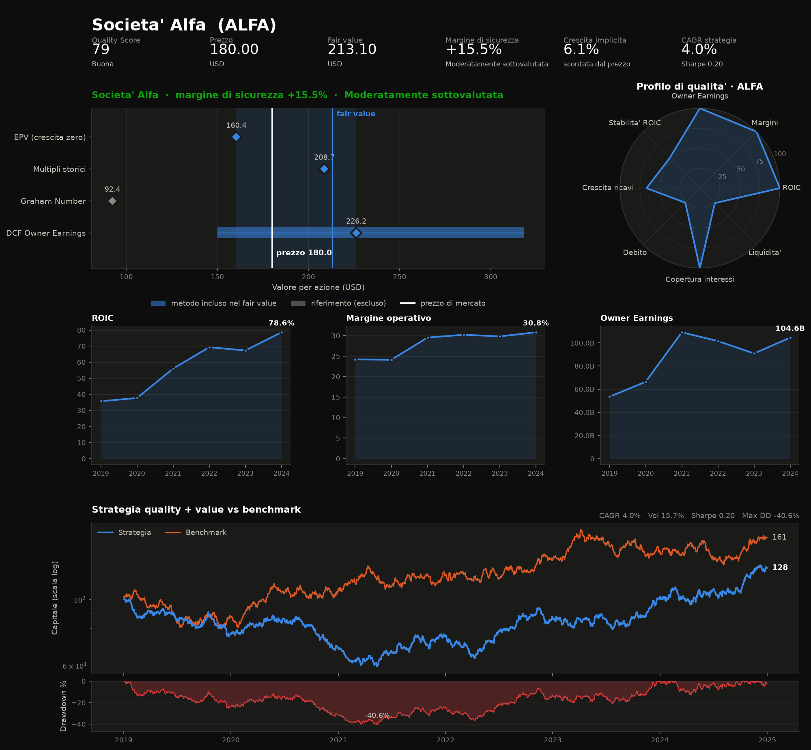
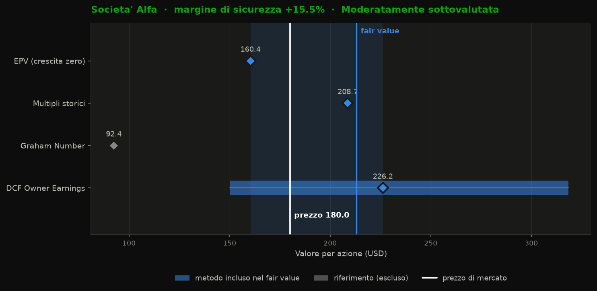
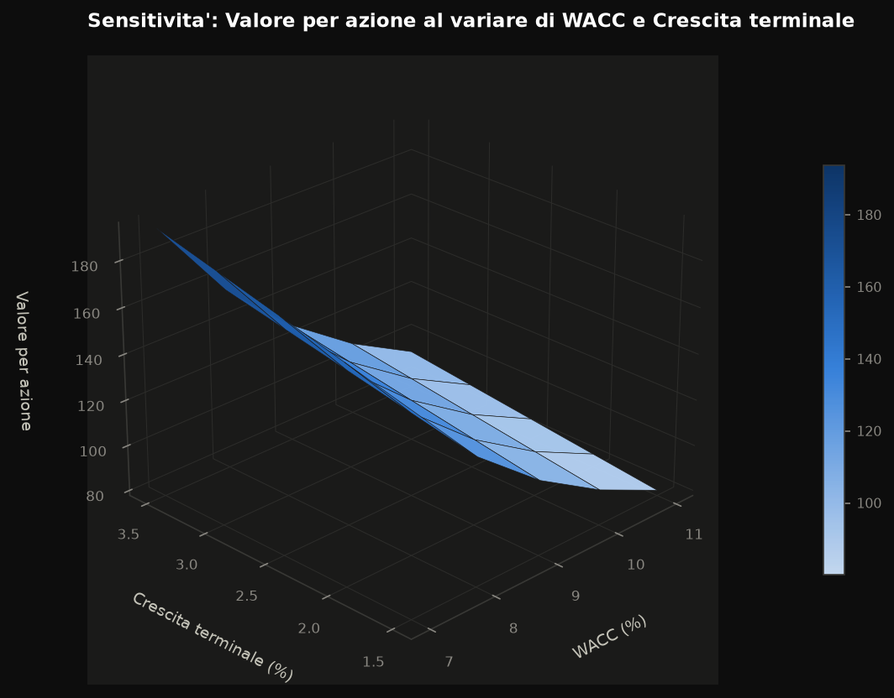
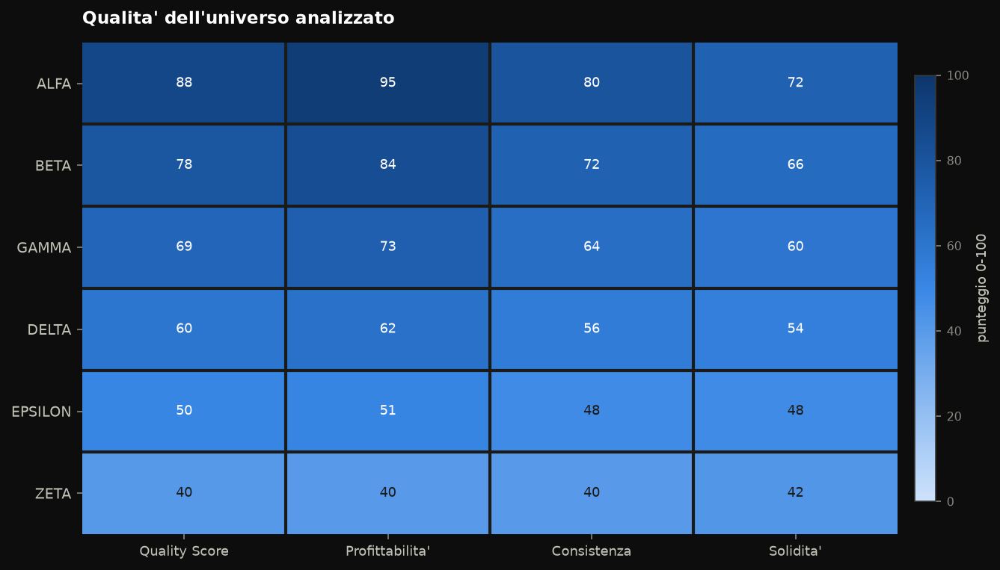
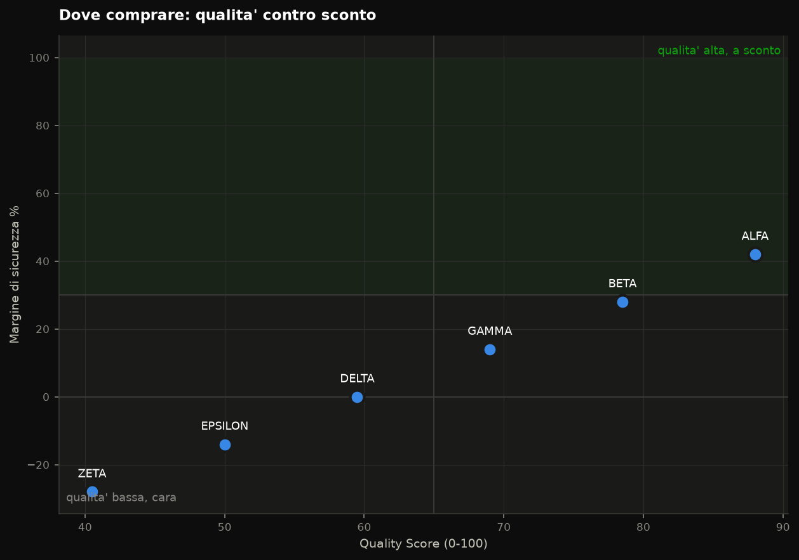

# value-quant-app

Modello quantitativo per il *value investing*: seleziona aziende di qualita', ne stima
il valore intrinseco, verifica storicamente se la regola di selezione avrebbe funzionato
e mette tutto in un tear sheet leggibile.

Quattro moduli Python autonomi, testabili da riga di comando, senza interfaccia web.

```
value-quant-app/
├── run_analysis.py              punto d'ingresso: analizza, valuta, disegna
├── backend/models/
│   ├── quality_score.py         "e' una buona azienda?"      -> punteggio 0-100
│   ├── valuation.py             "a che prezzo vale la pena?" -> fair value e sconto
│   ├── backtest.py              "questa regola ha funzionato?" -> equity curve e rischio
│   └── visualize.py             tear sheet e grafici in tema scuro
└── tests/                       35 test offline, nessuna rete richiesta
```

## Avvio rapido

```bash
pip install -r requirements.txt

python run_analysis.py AAPL                       # un titolo: qualita' + valore + grafici
python run_analysis.py AAPL MSFT KO PG --backtest # universo + backtest della strategia
python run_analysis.py --demo                     # dati sintetici, senza rete
```

I grafici finiscono in `output/`. Su Google Colab si visualizzano con:

```python
from IPython.display import Image
Image("output/aapl_tearsheet.png")
```

## Anteprima

> Le immagini qui sotto sono generate da `python run_analysis.py --demo` con **bilanci
> sintetici**: servono a mostrare l'output del modello, non sono l'analisi di un titolo reale.

Il tear sheet completo — numeri chiave, valutazione, profilo di qualita', storico e backtest:



| Valutazione contro il prezzo | Sensitivita' del valore |
|---|---|
|  |  |

| Qualita' dell'universo | Dove comprare |
|---|---|
|  |  |

---

## 1. Quality Score — `backend/models/quality_score.py`

Scarica i bilanci annuali (conto economico, stato patrimoniale, rendiconto finanziario)
e calcola, anno per anno:

| Categoria | Metriche |
|---|---|
| Redditivita' | ROIC = NOPAT / (Debito + Equity − Cassa), ROE, ROA, margine lordo/operativo/netto |
| Cassa | Owner Earnings = Utile netto + D&A − CapEx − Δ Capitale circolante, e OE / Ricavi |
| Solidita' | Debt/Equity, Debt/EBITDA, Interest Coverage, Current Ratio |
| Consistenza | dev. standard, coefficiente di variazione e % di anni in crescita per ogni serie |

Il punteggio finale 0-100 e' la media pesata di tre categorie — default **40%**
profittabilita', **30%** consistenza, **30%** solidita' — con soglie di normalizzazione
esplicite riportate accanto a ogni componente. Se una categoria non e' calcolabile, il
suo peso si ridistribuisce sulle altre.

```bash
python backend/models/quality_score.py AAPL MSFT
```

## 2. Valuation — `backend/models/valuation.py`

| Metodo | Cosa risponde |
|---|---|
| **DCF sugli Owner Earnings** | quanto vale l'azienda scontando la cassa che genera davvero |
| **Reverse DCF** | quale crescita e' *gia' scontata* nel prezzo di oggi |
| **EPV (Greenwald)** | quanto varrebbe se non crescesse mai piu' — il pavimento |
| **Multipli storici** | com'e' prezzata rispetto alla propria mediana storica |
| **Graham Number / NCAV** | riferimenti deep value (mostrati, esclusi dalla sintesi) |

Il DCF e' a due stadi con *fade*: N anni di crescita esplicita e poi discesa lineare
verso la crescita terminale, così da evitare il salto artificiale che gonfia i DCF
ingenui. Il WACC viene ricostruito con il CAPM (Ke = risk free + β × premio al rischio)
e il costo effettivo del debito a bilancio, poi limitato a una fascia prudenziale.

Il fair value di sintesi e' la **media pesata** dei metodi "going concern"
(DCF 60%, multipli storici 25%, EPV 15%, rinormalizzati su quelli disponibili).
Graham Number e NCAV restano fuori: nascono per aziende asset-heavy comprate a sconto
sul patrimonio, e su un'azienda asset-light producono numeri sistematicamente
insignificanti.

```bash
python backend/models/valuation.py AAPL
python backend/models/valuation.py AAPL --growth 0.06 --wacc 0.09
```

Output: fair value con intervallo, margine di sicurezza, prezzo d'acquisto obiettivo,
tre scenari (bear/base/bull), crescita implicita nel prezzo e griglia di sensitivita'
WACC × crescita terminale.

## 3. Backtest — `backend/models/backtest.py`

Strategia: a ogni ribilanciamento classifica l'universo su **qualita'** (il Quality
Score) e **prezzo** (earnings yield EBIT/EV), compra i primi `top_n`, tiene fino al
ribilanciamento successivo.

**Il punto delicato e' il point-in-time.** Il modo piu' facile di produrre un backtest
bellissimo e falso e' usare oggi dati che nel passato non erano ancora pubblici. Qui
ogni decisione presa alla data D usa solo esercizi con
`fine esercizio + 90 giorni ≤ D`. C'e' un test dedicato (`test_niente_look_ahead`) che
inserisce nell'universo un titolo pessimo fino al 2021 e ottimo dal 2022, e verifica
che il modello non lo scelga prima che quei bilanci fossero depositati.

Metriche prodotte: CAGR, volatilita', Sharpe, Sortino, max drawdown, Calmar, beta,
alpha di Jensen, tracking error, information ratio, turnover.

**Cosa resta comunque distorto** — stampato a ogni esecuzione, non nascosto nella
documentazione:

- **Survivorship bias**: l'universo contiene solo societa' esistenti oggi.
- **Restatement**: yfinance espone i bilanci rivisti, non quelli originariamente depositati.
- **Storico corto**: 4-5 esercizi disponibili significano pochi ribilanciamenti; su
  cosi' pochi periodi la differenza col benchmark e' rumore, non evidenza.
- **Multiple testing**: `sweep_parameters` esplora una griglia. Scegliere la cella
  migliore *dopo* aver visto i risultati e' overfitting — la griglia serve a vedere se
  esiste un altopiano ampio, non a trovare il picco.

```bash
python backend/models/backtest.py AAPL MSFT KO PG JNJ V MA HD
```

## 4. Grafici — `backend/models/visualize.py`

| Grafico | A cosa serve |
|---|---|
| `plot_equity_curve` | capitale vs benchmark + drawdown in un pannello separato |
| `plot_football_field` | intervallo di valore per metodo contro il prezzo di mercato |
| `plot_quality_radar` | profilo di qualita' su 8 assi, fino a 3 titoli a confronto |
| `plot_metrics_history` | ROIC, margini, Owner Earnings in riquadri affiancati |
| `plot_universe_heatmap` | punteggi di piu' titoli su una scala unica 0-100 |
| `plot_quality_value_scatter` | la matrice qualita' / sconto con i quadranti operativi |
| `plot_sensitivity_surface` | superficie 3D (o curve di livello) di sensitivita' |
| `create_tearsheet` | tutto in una pagina |

Tre scelte di progetto, non estetiche:

- **niente doppio asse y**: due scale sullo stesso riquadro inventano correlazioni che
  nei dati non ci sono. Il drawdown sta in un pannello proprio;
- **niente scale arcobaleno**: per le magnitudini una sola tinta dal chiaro allo scuro,
  perche' l'arcobaleno crea bande che il lettore scambia per soglie;
- **palette verificata per i deficit di visione dei colori**, con ogni coppia adiacente
  separata in modo misurato e ogni valore leggibile anche come numero, mai solo a colore.

```bash
python backend/models/visualize.py            # demo di tutti i grafici
python backend/models/visualize.py --show     # a schermo invece che su file
```

---

## Dati stimati e mancanti

Nessun modulo solleva eccezioni sui dati incompleti: calcola quello che puo' e registra
tutto in `data_quality`, distinguendo `estimated` (approssimazioni) da `missing`.
Le approssimazioni tipiche:

- **CapEx di mantenimento**: non separabile in bilancio, si usa il **CapEx totale** come
  proxy — gli Owner Earnings risultano quindi prudenziali;
- EBIT approssimato col reddito operativo, o stimato come utile ante imposte + oneri finanziari;
- EBITDA stimato come EBIT + D&A quando non riportato;
- debito totale ricostruito come debito a breve + lungo termine;
- Δ capitale circolante stimata dallo stato patrimoniale se manca nel rendiconto;
- aliquota fiscale effettiva sostituita col default (25%) quando anomala;
- beta e costo del debito sostituiti da valori prudenziali quando non recuperabili.

**Nota sullo storico**: i moduli chiedono 10 esercizi, ma yfinance ne espone tipicamente
4-5. Vengono usati quelli disponibili e il numero effettivo e' sempre riportato in
`data_quality.years_available`. Per uno storico decennale serve una fonte diversa
(l'endpoint `companyfacts` XBRL della SEC e' gratuito e copre 10+ anni).

## Test

35 test offline con bilanci e prezzi sintetici, nessuna rete richiesta:

```bash
python tests/test_quality_score.py    # metriche di bilancio e consistenza
python tests/test_valuation.py        # DCF, reverse DCF, EPV, WACC (verifiche analitiche)
python tests/test_backtest.py         # point-in-time, metriche di rischio, sweep
python tests/test_pipeline.py         # integrazione: i grafici sui dizionari reali
```

Dove possibile i test non confrontano con "un numero che sembra giusto" ma con il
risultato che la formula deve dare per costruzione: il DCF a crescita zero deve valere
esattamente `flusso / tasso`, il reverse DCF deve ritrovare la crescita da cui e'
partito, una serie confrontata con se stessa deve avere beta 1 e alpha 0.

## Avvertenza

Questo e' uno strumento di analisi, non un consiglio di investimento. I risultati
dipendono da ipotesi esplicite che vanno discusse, non accettate: cambiare il WACC di
un punto o la crescita di due sposta il fair value di decine di punti percentuali — la
griglia di sensitivita' serve esattamente a rendere visibile quella fragilita'.
